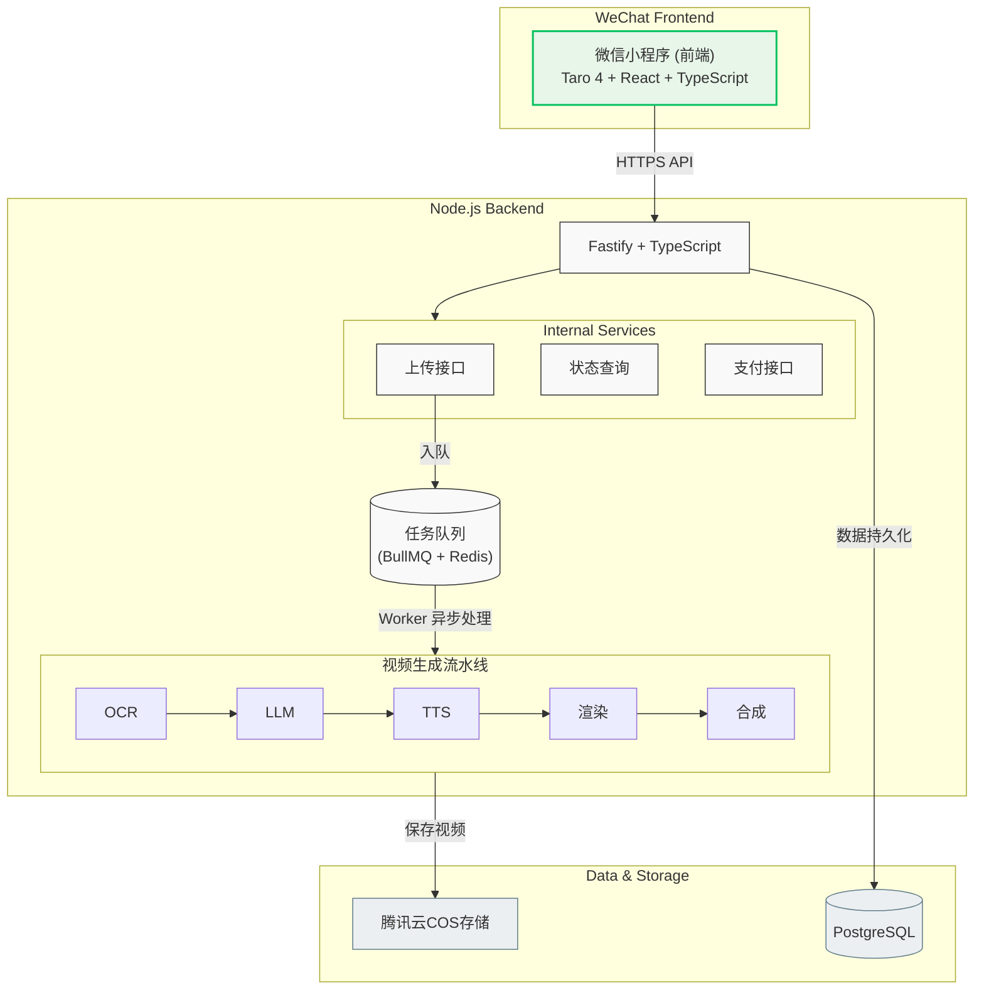

# 爸妈看懂 (EchoHealth)

[English](./README_EN.md) | 简体中文

> **让体检报告“说话”，把冰冷的指标转化为有温度的健康视频。**
> 
> 📸 拍照上传体检报告 → 🤖 AI 深度解读 → 🎥 自动化生成短视频 → 📱 微信分享给父母


---

## 🌟 产品简介

**EchoHealth** 是一款专为「关心父母健康的子女」设计的健康交互工具。

我们深知父母拿到体检报告时的迷茫：指标太多看不懂、医生太忙没空讲、专业术语太冷冰。EchoHealth 通过 AI 技术将复杂的医疗数据，在 90 秒内转化为中老年人也能听得懂、看得清的**人声配音解读短视频**，让子女的一份关心，能以最直观的方式传递到父母手机里。

**核心链路：** 拍照上传 → AI 解读 → 生成短视频 → 微信分享给父母

## 🚀 技术栈

| 模块 | 技术选型 |
| :--- | :--- |
| **小程序前端** |    |
| **后端服务** |    |
| **数据存储** |    |
| **核心引擎** |    |
| **云服务** | 腾讯云医疗 OCR + 腾讯云 COS + Edge TTS |

## 🏗 技术架构



## 📂 项目结构

```text
EchoHealth/
├── apps/
│   ├── miniprogram/     # Taro 微信小程序
│   └── server/          # Fastify 后端服务
├── packages/
│   └── video/           # Remotion 视频模板
├── docs/
│   └── plans/           # 设计文档
└── README.md
```

## 🛠 本地开发

```bash
# 安装依赖
pnpm install

# 启动后端服务
pnpm --filter server dev

# 启动小程序开发预览
pnpm --filter miniprogram dev:weapp
```

## 📖 设计文档

详细的产品设计与技术规划方案请参阅：[`docs/plans/2026-02-27-echohealth-design.md`](docs/plans/2026-02-27-echohealth-design.md)

---

## License

MIT © [EchoHealth]
