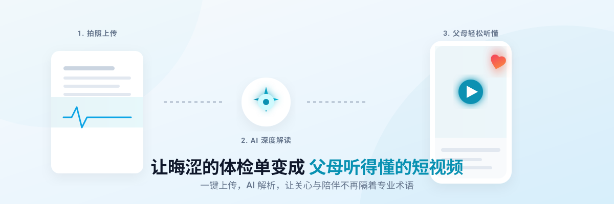
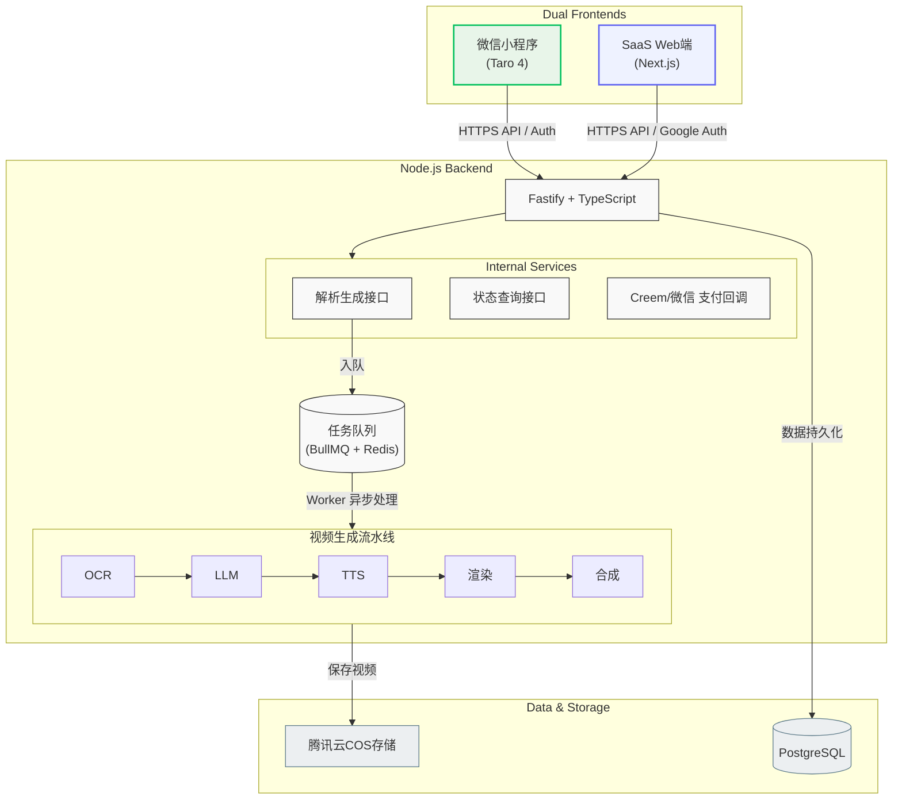

# 爸妈看懂 (EchoHealth)

[English](./README_EN.md) | 简体中文

> **让体检报告“说话”，把冰冷的指标转化为有温度的健康视频。**
> 
> 📸 拍照上传体检报告 → 🤖 AI 深度解读 → 🎥 自动化生成短视频 → 📱 微信分享给父母



---

## 🌟 产品简介

**EchoHealth** 是一款专为「关心父母健康的子女」设计的健康交互工具。

我们深知父母拿到体检报告时的迷茫：指标太多看不懂、医生太忙没空讲、专业术语太冷冰。EchoHealth 通过 AI 技术将复杂的医疗数据，在 90 秒内转化为中老年人也能听得懂、看得清的**人声配音解读短视频**，让子女的一份关心，能以最直观的方式传递到父母手机里。

**核心链路：** 拍照上传 → AI 解读 → 生成短视频 → 微信分享给父母

## 🚀 部署状态

- **SaaS Web 版**：已上线，立即体验 👉 [echohealth.mintmind.io](https://echohealth.mintmind.io)
- **微信小程序版**：*审核中* ⏳

## 🛠 技术栈

| 模块 | 技术选型 |
| --- | --- |
| **SaaS Web 前端** |     |
| **小程序前端** |    |
| **后端服务** |    |
| **数据存储** |    |
| **核心引擎** |    |
| **云服务 & 支付** | 腾讯云医疗 OCR + 腾讯云 COS + Edge TTS + Creem Checkout |

## 🏗 技术架构


```mermaid
graph TD
    %% 统一样式定义
    classDef primary fill:#e8f5e9,stroke:#07c160,stroke-width:2px;
    classDef saas fill:#eef2ff,stroke:#6366f1,stroke-width:2px;
    classDef secondary fill:#f9f9f9,stroke:#333,stroke-width:1px;
    classDef neutral fill:#eceff1,stroke:#607d8b,stroke-width:1px;

    subgraph Frontends [Dual Frontends]
        direction LR
        A["微信小程序<br/>(Taro 4)"]:::primary
        W["SaaS Web端<br/>(Next.js)"]:::saas
    end

    subgraph Backend [Node.js Backend]
        direction TB
        B["Fastify + TypeScript"]:::secondary
        
        subgraph Services [Internal Services]
            S1["解析生成接口"]:::secondary
            S2["状态查询接口"]:::secondary
            S3["Creem/微信 支付回调"]:::secondary
        end
        
        Q[("任务队列<br/>(BullMQ + Redis)")]:::secondary
        
        subgraph Pipeline [视频生成流水线]
            direction LR
            P1["OCR"] --> P2["LLM"] --> P3["TTS"] --> P4["渲染"] --> P5["合成"]
        end
        class Pipeline primary
    end

    subgraph Data [Data & Storage]
        COS["腾讯云COS存储"]:::neutral
        DB[("PostgreSQL")]:::neutral
    end

    %% 关系链路
    A -- "HTTPS API / Auth" --> B
    W -- "HTTPS API / Google Auth" --> B
    B --> Services
    S1 -- "入队" --> Q
    Q -- "Worker 异步处理" --> Pipeline
    
    Pipeline -- "保存视频" --> COS
    B -- "数据持久化" --> DB
```

## 📂 项目结构（Monorepo）

```text
EchoHealth/
├── apps/
│   ├── web/             # Next.js SaaS Web 版前端
│   ├── miniprogram/     # Taro 微信小程序版前端
│   └── server/          # Fastify 后端核心 API 与 Worker
├── packages/
│   └── video/           # Remotion 视频模板库（与端无关）
├── docs/
│   └── superpowers/     # 系统规划与 AI Agent 指令集
└── README.md
```

## 🛠 本地开发

```bash
# 全局安装依赖
pnpm install

# 启动后端服务 (localhost:3001)
pnpm --filter server dev

# 启动 SaaS Web 预览版 (localhost:3000)
pnpm --filter web dev

# 启动小程序开发预览
pnpm --filter miniprogram dev:weapp
```

## 📊 核心进度墙

> 最新基线同步：2026-03-20

### 🚀 阶段三：SaaS 化与多端架构（当前阶段）
- [x] 重构 Monorepo 架构兼容 Web 端
- [x] Next.js 国际化多语言（i18n）架构
- [x] Web 端 Google OAuth 快速登录授权
- [x] **首页即工具模式**：集成拖拽上传与一键生成引擎
- [x] 接通 Creem 全球支付 Checkout
- [x] Next.js 静态部署至 Vercel (`echohealth.mintmind.io`)
- [ ] 微信小程序代码审核结果跟进

### 🎬 阶段二：生成流水线与云设施
- [x] 腾讯云 OCR 医疗影像高精度解析
- [x] 接入 Claude 3.5 Sonnet 提炼健康摘要并生成视听脚本
- [x] Edge TTS 高拟真语音合成
- [x] `packages/video` 剥离，开发适用大中屏的 Remotion 模板套件
- [x] 渲染层打通腾讯云 COS 对象存储异步直传流

### 🏗 阶段一：底层基建搭建
- [x] 初始化 pnpm workspace + Fastify + Prisma + Redis
- [x] 确立 BullMQ 异步非阻塞生成队列模式
- [x] 微信小程序完成静默鉴权与 jscode2session 登录
- [x] 小程序首页、上传进度与结果页开发
- [x] 高覆盖率服务端测试单元编写

---

## 📖 扩展阅读与文档

详细的模块设计方案、系统架构演进，请参阅 `docs/` 目录：
- [SaaS Web 端架构设计文档](docs/superpowers/plans/2026-03-10-web-saas-architecture.md)
- [全局支付模式设计与重构](docs/superpowers/plans/2026-03-15-payment-system.md)
- [部署与运维指南](docs/deploy.md)

---

## License

MIT © [EchoHealth]
