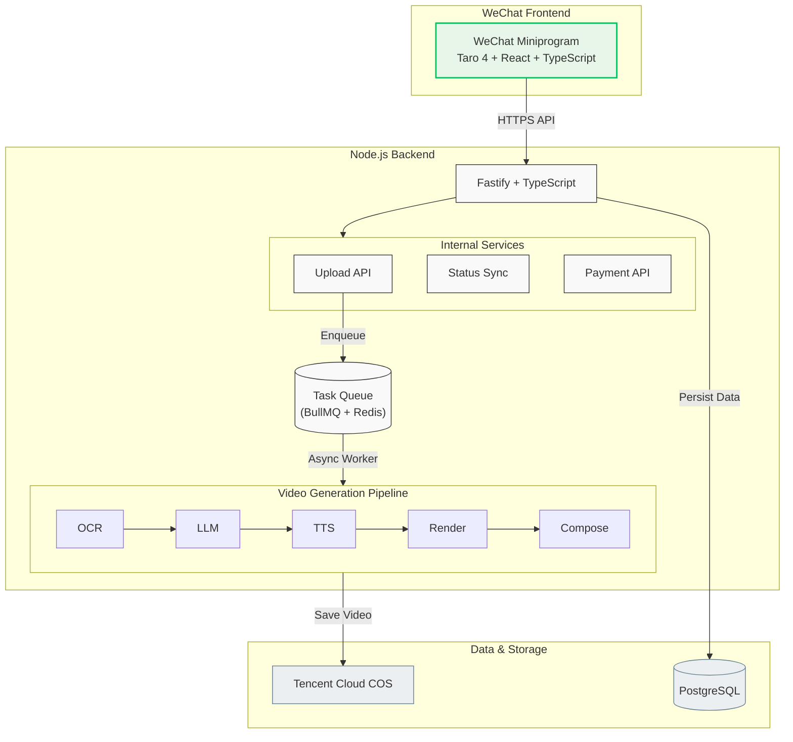

# EchoHealth (爸妈看懂)

English | [简体中文](./README.md)

> **Make health reports "talk" and transform icy clinical data into warm health videos.**
> 
> 📸 Upload Photo → 🤖 AI Deep Analysis → 🎥 Automated Video Generation → 📱 Share to Parents via WeChat


---

## 🌟 Introduction

**EchoHealth** is a health interaction tool designed for children who care about their parents' health.

We understand the confusion parents face with health reports: too many indicators to understand, doctors being too busy, and professional terminology being too cold. EchoHealth utilizes AI technology to transform complex medical data into **voice-over explanatory short videos** that the elderly can understand and see clearly within 90 seconds, allowing a child's care to be delivered to their parents' phones in the most intuitive way.

**Core Workflow:** Photo Upload → AI Interpretation → Video Generation → WeChat Sharing

## 🚀 Tech Stack

| Module | Tech Stack |
| :--- | :--- |
| **Frontend** |    |
| **Backend** |    |
| **Data Storage** |    |
| **Core Engine** |    |
| **Cloud Services** | Tencent Cloud Medical OCR + Tencent Cloud COS + Edge TTS |

## 🏗 Architecture



## 📂 Project Structure

```text
EchoHealth/
├── apps/
│   ├── miniprogram/     # Taro WeChat Miniprogram
│   └── server/          # Fastify Backend Service
├── packages/
│   └── video/           # Remotion Video Templates
├── docs/
│   └── plans/           # Design Documents
└── README.md
```

## 🛠 Local Development

```bash
# Install dependencies
pnpm install

# Start backend service
pnpm --filter server dev

# Start miniprogram dev preview
pnpm --filter miniprogram dev:weapp
```

## 📊 Development Progress

> Last updated: 2026-02-27

### MVP Core Pipeline — All Complete ✅

| # | Module | Task | Status |
|---|--------|------|--------|
| 1 | Infrastructure | Monorepo init (pnpm workspace) | ✅ |
| 2 | Backend | Fastify backend project init | ✅ |
| 3 | Database | Prisma schema (User / Report / Video / Order) | ✅ |
| 4 | Queue | Redis + BullMQ task queue | ✅ |
| 5 | Pipeline | Tencent Cloud OCR image recognition | ✅ |
| 6 | Pipeline | Claude API LLM script generation | ✅ |
| 7 | Pipeline | edge-tts TTS audio generation | ✅ |
| 8 | Video | Remotion 4 video templates (5 slide types) | ✅ |
| 9 | Video | @remotion/renderer render + Tencent COS upload | ✅ |
| 10 | Backend | BullMQ Worker 8-step pipeline | ✅ |
| 11 | Backend | REST API (POST /reports, GET /reports/:id) | ✅ |
| 12 | Backend | Quota middleware + WeChat jscode2session login | ✅ |
| 13 | Miniprogram | Taro 4 miniprogram scaffold | ✅ |
| 14 | Miniprogram | 3-page implementation (Home / Upload / Result) | ✅ |

### Test Coverage

- **Server**: 11 test files, **45 test cases all passing**, `tsc` zero errors
- **Scope**: OCR parsing, LLM scripting, TTS generation, Remotion rendering, COS upload, Worker pipeline, REST API, quota middleware, WeChat login

### Upcoming (Next Phase)

- [ ] WeChat Pay Pro upgrade flow
- [ ] Device testing (requires real WeChat AppID, COS / Tencent credentials)
- [ ] Production deployment (server + PostgreSQL + Redis)
- [ ] CI/CD pipeline

## 📖 Documentation

For detailed product design and technical planning, please refer to: [`docs/plans/2026-02-27-echohealth-design.md`](docs/plans/2026-02-27-echohealth-design.md)

---

## License

MIT © [Young]
