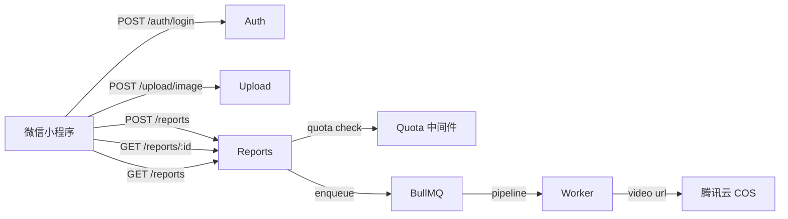
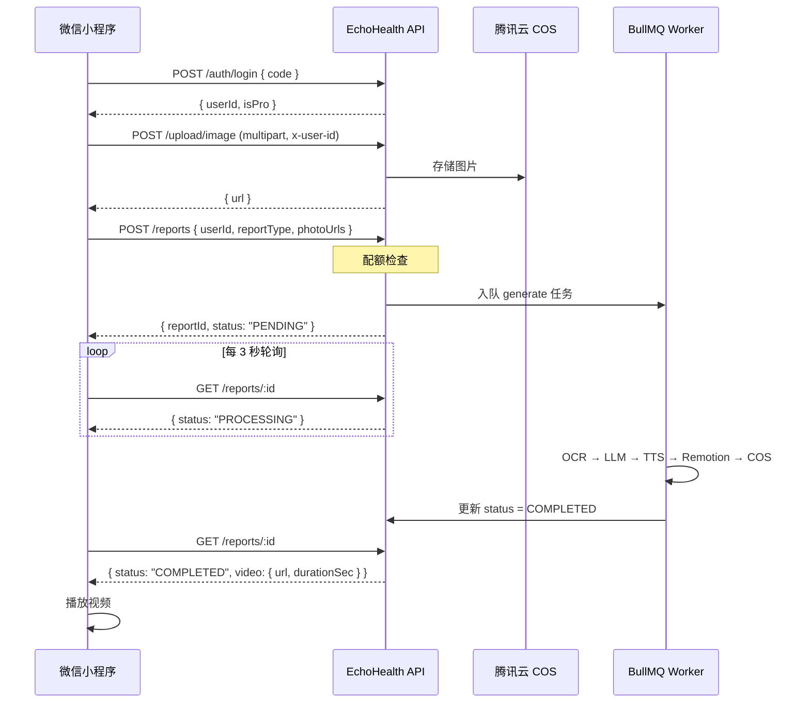

# EchoHealth API 文档

**Base URL（本地）：** `http://localhost:3000`
**Base URL（生产）：** `https://api.echohealth.app`（待定）
**协议：** HTTP/HTTPS，JSON body，UTF-8 编码

---

## 概览



### 通用规则

| 规则 | 说明 |
|------|------|
| 内容类型 | `Content-Type: application/json`（除文件上传外） |
| 用户标识 | 通过 `userId`（请求体）或 `x-user-id`（Header）传递 |
| 错误格式 | `{ "error": "描述信息" }` |
| 时间格式 | ISO 8601，UTC，例：`2026-02-27T10:00:00.000Z` |

---

## 接口列表

### GET /health

健康检查，用于探活。

**响应 200**
```json
{ "status": "ok" }
```

---

### POST /auth/login

微信登录。用微信临时 code 换取 `userId`，首次登录自动注册用户。

**请求体**

| 字段 | 类型 | 必填 | 说明 |
|------|------|------|------|
| `code` | string | ✅ | 微信 `wx.login()` 返回的临时 code |
| `nickname` | string | — | 用户昵称（可选，更新用） |
| `avatarUrl` | string | — | 头像 URL（可选，更新用） |

```json
{
  "code": "wx_temp_code_xxxxxx",
  "nickname": "张三",
  "avatarUrl": "https://thirdwx.qlogo.cn/..."
}
```

**响应 200**

```json
{
  "userId": "cma1b2c3d4e5f6g7h8i9j0",
  "isPro": false
}
```

**错误**

| 状态码 | 原因 |
|--------|------|
| 400 | code 缺失 |
| 500 | 微信 API 调用失败（code 无效/已过期） |

---

### POST /upload/image

上传报告图片到腾讯云 COS，返回可访问的 HTTPS URL。

**请求头**

| Header | 必填 | 说明 |
|--------|------|------|
| `x-user-id` | ✅ | 用户 ID（来自 `/auth/login`） |
| `Content-Type` | ✅ | `multipart/form-data` |

**请求体**

`multipart/form-data`，字段名为 `file`，支持 JPEG/PNG/HEIC，最大 **10 MB**。

**响应 200**

```json
{
  "url": "https://echohealth-1234567890.cos.ap-guangzhou.myqcloud.com/images/cma.../1706400000000.jpg"
}
```

**错误**

| 状态码 | 原因 |
|--------|------|
| 400 | 未上传文件 |
| 401 | 缺少 `x-user-id` Header |

---

### POST /reports

创建报告并入队生成任务。受**配额中间件**保护，每月有次数限制。

> **注意：** 本接口在处理前会先进行配额校验，超限返回 `429`。

**请求体**

| 字段 | 类型 | 必填 | 说明 |
|------|------|------|------|
| `userId` | string | ✅ | 用户 ID |
| `reportType` | string | ✅ | 报告类型（见下方映射表） |
| `photoUrls` | string[] | ✅ | 报告图片 URL 数组（至少 1 张，来自 `/upload/image`） |

**reportType 映射表**

前端传入中文名称，服务端自动映射到内部枚举：

| 前端传值 | 内部枚举 |
|----------|---------|
| 血常规、尿常规 | `BLOOD_ROUTINE` |
| 血脂、肝功能、肾功能、血糖、生化检查 | `BIOCHEMISTRY` |
| 综合体检、心电图、胸片/CT、其他 | `PHYSICAL_EXAM` |

```json
{
  "userId": "cma1b2c3d4e5f6g7h8i9j0",
  "reportType": "血常规",
  "photoUrls": [
    "https://echohealth-xxx.cos.ap-guangzhou.myqcloud.com/images/cma.../123.jpg"
  ]
}
```

**响应 201**

```json
{
  "reportId": "cmb9z8y7x6w5v4u3t2s1r0",
  "status": "PENDING"
}
```

**错误**

| 状态码 | 原因 |
|--------|------|
| 400 | 请求体缺少必填字段 |
| 404 | userId 不存在 |
| 429 | 月度配额已用完（见配额说明） |

---

### GET /reports/:id

查询单个报告的处理状态和结果。小程序通过**轮询**此接口（建议间隔 3 秒）追踪进度。

**路径参数**

| 参数 | 说明 |
|------|------|
| `id` | 报告 ID（来自 `POST /reports` 的 `reportId`） |

**响应 200**

```json
{
  "id": "cmb9z8y7x6w5v4u3t2s1r0",
  "reportType": "BLOOD_ROUTINE",
  "status": "COMPLETED",
  "errorMsg": null,
  "video": {
    "url": "https://echohealth-xxx.cos.ap-guangzhou.myqcloud.com/videos/cmb.../1706400000000.mp4",
    "durationSec": 62,
    "createdAt": "2026-02-27T10:05:00.000Z"
  },
  "createdAt": "2026-02-27T10:00:00.000Z",
  "updatedAt": "2026-02-27T10:05:00.000Z"
}
```

**status 状态说明**

| 值 | 含义 | 建议行为 |
|----|------|---------|
| `PENDING` | 排队等待 Worker 处理 | 继续轮询 |
| `PROCESSING` | 流水线正在执行（OCR→LLM→TTS→渲染） | 继续轮询 |
| `COMPLETED` | 视频生成完成，`video` 字段有值 | 停止轮询，展示视频 |
| `FAILED` | 生成失败，`errorMsg` 包含原因 | 停止轮询，展示错误 |

**错误**

| 状态码 | 原因 |
|--------|------|
| 404 | 报告不存在 |

---

### GET /reports

获取某用户的最近报告列表，用于首页展示历史记录。

**Query 参数**

| 参数 | 类型 | 必填 | 说明 |
|------|------|------|------|
| `userId` | string | ✅ | 用户 ID |
| `limit` | string | — | 返回数量，默认 `5`，最大 `20` |

**示例请求**

```
GET /reports?userId=cma1b2c3d4e5f6g7h8i9j0&limit=5
```

**响应 200**

```json
[
  {
    "id": "cmb9z8y7x6w5v4u3t2s1r0",
    "reportType": "BLOOD_ROUTINE",
    "status": "COMPLETED",
    "createdAt": "2026-02-27T10:00:00.000Z",
    "videoUrl": "https://echohealth-xxx.cos.ap-guangzhou.myqcloud.com/videos/..."
  },
  {
    "id": "cmc1a2b3c4d5e6f7g8h9i0j",
    "reportType": "PHYSICAL_EXAM",
    "status": "PENDING",
    "createdAt": "2026-02-26T08:00:00.000Z",
    "videoUrl": null
  }
]
```

**错误**

| 状态码 | 原因 |
|--------|------|
| 400 | 缺少 userId 参数 |

---

## 配额说明

配额由 `POST /reports` 的 preHandler 中间件统一管控。

| 用户类型 | 月度上限 | 重置时间 |
|----------|---------|---------|
| 免费用户 | 3 次/月 | 每月 1 日自然重置 |
| Pro 用户 | 30 次/月 | 每月 1 日自然重置 |

**超限响应 429**

```json
{
  "error": "Monthly quota exceeded",
  "used": 3,
  "limit": 3
}
```

---

## 典型调用流程



---

## 错误码汇总

| HTTP 状态码 | 含义 | 常见场景 |
|------------|------|---------|
| 200 | 成功 | GET 请求 |
| 201 | 创建成功 | POST /reports |
| 400 | 请求参数错误 | 缺少必填字段、格式错误 |
| 401 | 未认证 | 缺少 x-user-id |
| 404 | 资源不存在 | userId/reportId 无效 |
| 429 | 配额超限 | 月度次数用完 |
| 500 | 服务器内部错误 | 第三方 API 失败、代码异常 |
