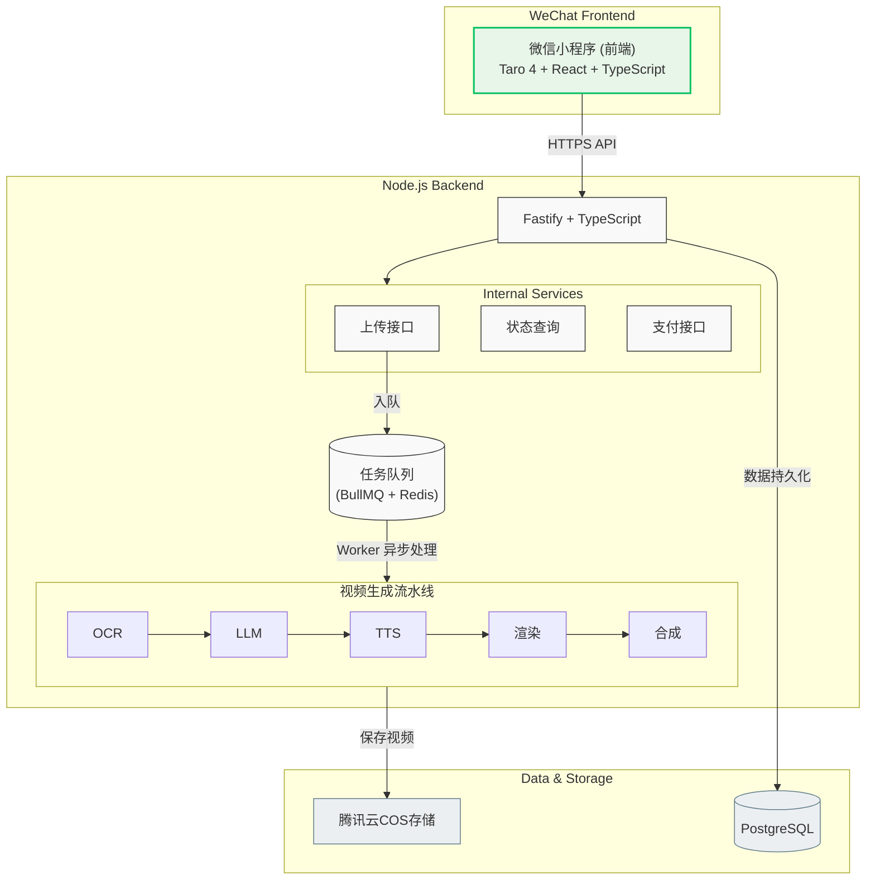
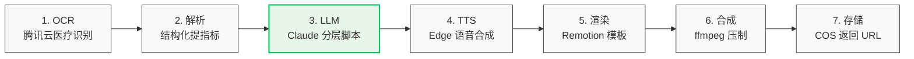
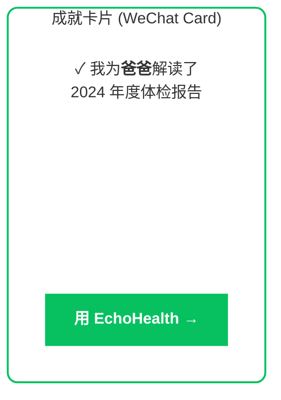

# EchoHealth 产品设计文档

**日期：** 2026-02-27
**状态：** 已确认，待实施
**作者：** 独立开发

---

## 一、产品定位

### 核心价值主张

EchoHealth 是一款面向「关注父母健康的子女」的微信小程序。用户上传父母的体检报告照片，AI 自动生成通俗易懂的解读短视频，子女将视频分享给父母，帮助中老年人理解自己的健康状况。

### 痛点

- 中老年人看到体检报告充满专业术语，不知道哪些指标需要关注
- 子女难以用电话/文字向父母解释复杂医疗数据
- 市面上现有产品（好大夫、丁香医生等）提供图文解读，无视频输出，缺乏温度感

### 差异化

**报告照片 → AI 解读 → 可分享短视频**，这一完整链路目前市场空白。视频形式更适合中老年人消费，且天然具备情感温度。

---

## 二、目标用户

| 角色 | 描述 |
|---|---|
| **主要用户（操作者）** | 25-45 岁子女，关心父母健康，具备基本智能手机使用能力 |
| **最终受益者** | 50-75 岁中老年父母，接收并观看子女分享的解读视频 |

---

## 三、产品名称

| 语言 | 名称 | 说明 |
|---|---|---|
| 英文 | **EchoHealth** | Echo = 回响/解读，将医疗信息以易懂形式"回传"给用户 |
| 中文 | **爸妈看懂** | 情感直击，精准定位子女为父母解读的场景（暂定） |

---

## 四、竞品分析

| 产品 | 形式 | 差距 |
|---|---|---|
| 平安好医生 | 图文解读 | 无视频，面向全年龄段，非家庭分享场景 |
| 京东健康 | 图文 + 在线问诊 | 无自动化视频生成 |
| 丁香医生 | 健康科普 | 非个性化报告解读 |
| 好大夫在线 | 医生问诊 | 成本高，非自动化 |
| 体检宝 / 健康元 | 报告管理 + 部分解读 | 无视频输出 |

**结论：「照片 → 视频」自动化链路目前是市场空白。**

---

## 五、商业模式

### 定价策略：免费裂变 + 家庭年卡

| 层级 | 价格 | 内容 |
|---|---|---|
| **免费** | 0 元 | 每月 1 次解读，1 位家庭成员 |
| **家庭年卡** | 99 元/年 | 无限次解读，最多 6 位家庭成员，历史存档，自定义片尾署名 |

### 定价逻辑

- 体检频率低（1-2 次/年），订阅制用户心理负担大，不适合
- 按次付费缺乏留存动力
- 家庭年卡：子女为全家买单，客单价合理，复购逻辑成立（每年体检）
- 99 元/年对「关心父母健康」的子女而言决策成本极低，情感驱动强

---

## 六、核心用户旅程

```
打开小程序
  → 微信一键登录
  → 拍照 / 上传体检报告（最多 3 张）
  → 选择报告类型（血常规 / 生化检查 / 体检总报告）
  → 等待生成（约 60-90 秒，进度页面）
  → 观看预览视频
  → 一键转发给父母（微信好友 / 家庭群）
```

---

## 七、视频内容结构

**时长：约 2 分钟**

| 时间段 | 内容 |
|---|---|
| 00:00 - 00:08 | 片头：「爸爸 / 妈妈的体检报告解读」 |
| 00:08 - 00:20 | 总体结论：「整体良好 / 有几项需要关注」 |
| 00:20 - 01:20 | 逐项解读：异常 / 偏高 / 偏低指标，用生活化语言解释 |
| 01:20 - 01:50 | 健康建议：饮食、生活习惯、是否需要复查 |
| 01:50 - 02:00 | 片尾：「由 [子女昵称] 特别为您解读 ❤️」 |

---

## 八、技术架构

### 整体架构



### 视频生成流水线



### 技术选型

| 模块 | 选型 | 理由 |
|---|---|---|
| 小程序框架 | Taro 4 + React | 可扩展 H5，语法统一 |
| 后端框架 | Fastify + TypeScript | 性能好，类型安全 |
| 数据库 | PostgreSQL + Prisma | 成熟稳定，ORM 效率高 |
| 任务队列 | BullMQ + Redis | 视频生成耗时，必须异步 |
| OCR | 腾讯云 OCR | 中文医疗表格识别率最高 |
| LLM | Claude Sonnet 4.6 API | 中文医疗解读质量最佳 |
| TTS | Edge TTS（edge-tts） | 免费，无并发限制 |
| 视频渲染 | Remotion | Node.js 生态，可编程动画 |
| 视频合成 | ffmpeg | 行业标准 |
| 对象存储 | 腾讯云 COS | 与微信生态打通，CDN 覆盖好 |
| 支付 | 微信支付 | 小程序唯一合规选项 |
| 部署 | 腾讯云 CVM | 国内合规，低延迟 |

> **注：** 运行时选择 Node.js 而非 Deno，原因是 Remotion 和 BullMQ 均仅支持 Node.js。

---

## 九、MVP 功能范围

### Phase 1 —— 核心验证（目标 4-6 周）

**做：**
- 微信登录
- 上传报告照片（最多 3 张）
- 报告类型选择（血常规 / 生化 / 体检总报告）
- 异步视频生成 + 进度页面
- 视频播放 & 一键转发
- 免费额度控制（每月 1 次）
- 微信支付（家庭年卡 99 元）

**不做：**
- 历史报告列表
- 家庭成员管理
- 指标趋势对比
- 独立分享 H5 页面
- 多语言支持

### Phase 2 —— 体验打磨（有付费用户后）

- 历史报告存档与查看
- 家庭成员档案（为爸爸/妈妈分别建立）
- 视频片尾自定义文案
- 微信订阅消息推送（生成完成通知）

### 开发优先级

```
Week 1-2   后端骨架 + 视频生成流水线（最难，优先打通）
Week 3     Remotion 动画视频模板设计（至少 1 套）
Week 4     微信小程序前端（上传 + 进度 + 播放）
Week 5     微信登录 + 微信支付接入
Week 6     测试 + 灰度发布给 10 个真实用户
```

### MVP 成功标准

- 端到端生成一个视频耗时 **< 90 秒**
- 视频解读内容经 **3 位非医学背景用户**验证，觉得准确且易懂
- 找到 **10 个真实付费用户**（哪怕是朋友圈）

---

## 十、增长策略

### 核心洞察

医疗数据属于隐私，**父母不会将健康视频转发到群里**，因此裂变主体是「子女」，而非「父母」。

### 有效裂变路径

| 路径 | 传播主体 | 内容 | 可行性 |
|---|---|---|---|
| ~~父母转发健康视频~~ | ~~父母~~ | ~~含隐私数据~~ | ❌ |
| 子女分享「行为成就卡片」 | 子女 | 仅显示姓名+日期，无健康数据 | ✅ |
| 子女口碑推荐 | 子女 | 产品链接 + 使用感受 | ✅ |
| 邀请好友返利 | 子女 | 邀请 1 人双方各得 1 次免费解读 | ✅ |

### 成就卡片设计

生成视频后弹出可分享卡片预览：



卡片不包含任何健康数据，子女可放心转发朋友圈，触达同龄有类似需求的朋友。

---

## 十一、风险与应对

| 风险 | 应对 |
|---|---|
| 医疗解读准确性 | AI 解读加「仅供参考，如有疑虑请咨询医生」免责声明；早期邀请医学顾问抽查 |
| 不同医院报告格式差异大 | Phase 1 只支持 3 种最常见报告类型，逐步扩展 |
| 视频生成耗时长 | 异步队列 + 进度页面 + 完成后通知，管理用户预期 |
| 医疗监管合规 | 定位为「健康科普」而非「医疗诊断」，措辞严格区分 |
| 大厂跟进 | 专注体验打磨和情感设计，建立用户口碑护城河 |

---

*文档基于 2026-02-27 头脑风暴会话整理，下一步进入实施计划阶段。*
