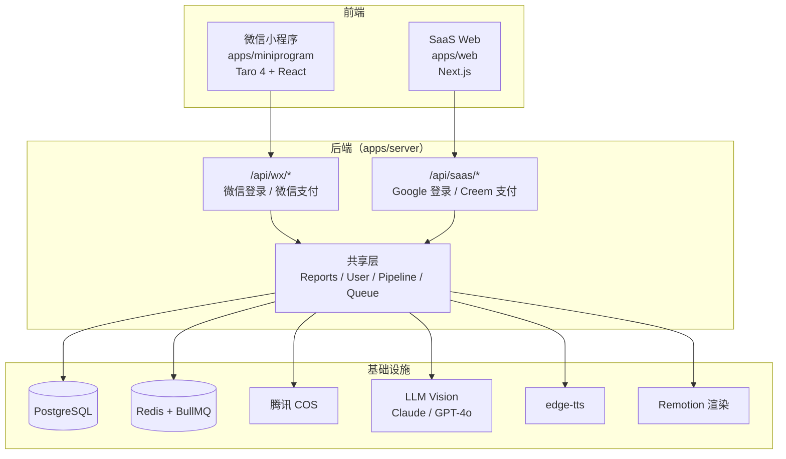

# EchoHealth SaaS 版设计规格

> 日期：2026-03-16

## 1. 产品定位

面向全球用户的体检报告视频解读 SaaS 平台，复用现有 EchoHealth 后端，新增 Web 前端。支持英文和中文。

## 2. 架构



## 3. 前端 `apps/web`（Next.js）

### 技术栈

- Next.js（App Router）
- React 18
- 部署到 Vercel
- 开发时遵循 web-design-guidelines skill 和 frontend-design skill

### 页面结构

| 页面 | 路由 | 功能 |
|------|------|------|
| Landing | `/` | 产品介绍、SEO 优化、CTA |
| Login | `/login` | Google OAuth 登录 |
| Dashboard | `/dashboard` | 报告列表、配额显示、新建入口 |
| Upload | `/upload` | 上传图片/PDF、选择视频语言 |
| Result | `/result/[id]` | 轮询状态、播放视频、下载 |
| Pricing | `/pricing` | Pro 套餐对比、Creem 订阅 |

### 视频语言选项（Upload 页）

用户上传材料后选择视频输出语言：
- **自动检测**（默认）— LLM 在提取指标时同时检测报告语言，作为视频输出语言
- **English** — 强制英文输出
- **中文** — 强制中文输出

## 4. 后端路由扩展

### 新增 SaaS 路由

```
POST   /api/saas/auth/google      Google OAuth 回调，创建/查找用户
GET    /api/saas/auth/me           获取当前用户信息（JWT）

POST   /api/saas/upload            上传图片/PDF（支持多文件）
POST   /api/saas/reports           创建报告 + 入队
GET    /api/saas/reports           报告列表
GET    /api/saas/reports/:id       轮询报告状态

POST   /api/saas/orders/checkout   创建 Creem checkout session
POST   /api/saas/webhook/creem     Creem 支付回调（subscription 状态更新）
```

### 认证方式

- **小程序：** 微信 jscode2session → openid → 直接作为身份标识
- **SaaS：** Google OAuth → id_token → 后端验证 → 签发 JWT

#### JWT 策略

- 签名密钥：`JWT_SECRET` 环境变量
- Access Token TTL：7 天
- 存储：httpOnly cookie，`SameSite=Lax`，`Secure=true`（生产环境）
- 无 refresh token（7 天过期后重新 Google 登录，降低复杂度）
- CSRF 防护：`SameSite=Lax` 阻止跨站 POST 请求；非 GET 路由额外校验 `Origin` header

### 路由共享

reports 的核心逻辑（创建、查询、状态轮询）通过 service 层共享，路由层只负责认证方式差异。

#### 统一用户上下文

Auth hook 将用户信息注入 `request.user`（无论来源是 openid 还是 JWT），下游中间件（如 quota）统一从 `request.user.id` 获取用户 ID。

## 5. 数据库扩展

### User 模型变更

```prisma
model User {
  // 现有字段保留
  openid        String?  @unique  // 改为可选（SaaS 用户无 openid）

  // 新增字段
  authProvider  AuthProvider @default(WECHAT)
  email         String?  @unique
  googleId      String?  @unique
}

enum AuthProvider {
  WECHAT
  GOOGLE
}
```

**迁移注意：** 两步迁移 —（1）ALTER openid 为 nullable，（2）ADD authProvider 列 DEFAULT 'WECHAT'，确保现有微信用户数据不受影响。PostgreSQL 允许 nullable unique 列存在多个 NULL 值。

### Report 模型变更

```prisma
model Report {
  // 现有字段保留

  // 新增字段
  language      VideoLanguage @default(AUTO)
  inputType     InputType     @default(IMAGE)
  source        ReportSource  @default(MINIPROGRAM)
}

enum VideoLanguage {
  AUTO
  EN
  ZH
}

enum InputType {
  IMAGE
  PDF
}

enum ReportSource {
  MINIPROGRAM
  WEB
}
```

### Subscription 模型（新增）

```prisma
model Subscription {
  id                    String             @id @default(cuid())
  userId                String
  user                  User               @relation(fields: [userId], references: [id])
  provider              PaymentProvider
  creemSubscriptionId   String?            @unique
  status                SubscriptionStatus
  currentPeriodStart    DateTime
  currentPeriodEnd      DateTime
  cancelledAt           DateTime?
  createdAt             DateTime           @default(now())
  updatedAt             DateTime           @updatedAt
}

enum SubscriptionStatus {
  ACTIVE
  CANCELLED
  PAST_DUE
  EXPIRED
}

enum PaymentProvider {
  WECHAT_PAY
  CREEM
}
```

Order 模型保持现有结构用于微信一次性支付，Creem 订阅通过 Subscription 模型管理。

### ReportType 扩展

```prisma
enum ReportType {
  BLOOD_ROUTINE
  BIOCHEMISTRY
  PHYSICAL_EXAM
  GENERAL        // 新增：海外用户通用类型
}
```

## 6. LLM Vision 成本分析与上传限制

### 6.1 LLM Vision 服务对比

| | **Gemini 2.5 Flash** | **Claude Sonnet 4.6** | **GPT-4o** |
|---|---|---|---|
| **Input 价格** | **$0.30/M tokens** | $3.00/M tokens | $2.50/M tokens |
| **Output 价格** | **$2.50/M tokens** | $15.00/M tokens | $10.00/M tokens |
| **图片 tokens** | ~1,300/张 | ~1,600/张 | ~1,100/张（high） |
| **每张图成本** | **~$0.0004** | ~$0.0048 | ~$0.0028 |
| **PDF 支持** | 原生 | 原生（≤32MB） | 原生 |
| **PDF tokens** | ~1,300/页 | 1,500-3,000/页 | ~1,500/页 |
| **每页 PDF 成本** | **~$0.0005** | ~$0.006 | ~$0.004 |
| **Context Window** | **1M** | 200K | 128K |
| **图片格式** | PNG, JPEG, WEBP, GIF | PNG, JPEG, WEBP, GIF | PNG, JPEG, WEBP, GIF |
| **最佳分辨率** | — | ≤1568px 双边 | ≤2048×2048 |

> 数据来源：[Gemini API Pricing](https://ai.google.dev/gemini-api/docs/pricing)、[Claude Pricing](https://platform.claude.com/docs/en/about-claude/pricing)、[OpenAI Pricing](https://platform.openai.com/docs/pricing)（截至 2026-03）

### 6.2 单次请求成本估算

假设用户上传 5 张图/页 + 脚本生成 ~2K output tokens：

| | Gemini 2.5 Flash | Claude Sonnet | GPT-4o |
|---|---|---|---|
| Vision input (5 张) | $0.002 | $0.024 | $0.014 |
| 脚本 output (~2K tokens) | $0.005 | $0.030 | $0.020 |
| **单次总计** | **~$0.007** | **~$0.054** | **~$0.034** |
| **1,000 次/月** | **~$7** | **~$54** | **~$34** |

### 6.3 LLM 分工策略

- **Vision 提取（OCR + 指标提取）：默认 Gemini 2.5 Flash** — 成本最低（Claude 的 1/8），结构化提取能力足够，1M context 对多页 PDF 更友好
- **脚本生成（解说文案创作）：继续用 Claude / OpenRouter** — 需要更强的语言创作能力
- 通过 `LLM_VISION_PROVIDER` 环境变量可切换（`gemini` | `claude` | `openai`）
- 通过 `LLM_SCRIPT_PROVIDER` 环境变量控制脚本生成模型（保持现有逻辑）

### 6.4 上传限制设计

基于成本控制和 LLM 能力限制：

| 限制项 | Free 用户 | Pro 用户 |
|--------|----------|---------|
| **图片数量** | 最多 3 张/次 | 最多 5 张/次 |
| **图片大小** | 单张 ≤5MB | 单张 ≤10MB |
| **图片分辨率** | 后端自动缩放到 ≤1568px | 后端自动缩放到 ≤1568px |
| **PDF 页数** | 最多 3 页 | 最多 5 页 |
| **PDF 大小** | ≤10MB | ≤20MB |
| **月度配额** | 3 次/月 | 30 次/月 |
| **单次成本上限** | ~$0.005 (Gemini) | ~$0.007 (Gemini) |

**图片预处理：** 所有图片在后端统一缩放到 ≤1568px（Claude 推荐最佳尺寸），既节省 token 又保证 OCR 质量。使用 `sharp` 库进行缩放。

**超限处理：**
- 图片数量/PDF 页数超限 → 返回 400 错误，提示用户减少文件数量
- 文件大小超限 → 返回 413 错误，提示压缩文件
- 月度配额用尽 → 返回 429 错误，引导升级 Pro

### 6.5 成本可持续性分析

| 用户规模 | Free 用户（3次/月） | Pro 用户（30次/月） | 月 LLM 成本（Gemini） |
|---------|-------------------|--------------------|-----------------------|
| 100 用户 | 300 次 | — | ~$2.1 |
| 1,000 用户 | 3,000 次 | — | ~$21 |
| 100 Pro | — | 3,000 次 | ~$21 |
| 1,000 Pro | — | 30,000 次 | ~$210 |

Pro 定价 $3-5/月时，30 次配额的 LLM 成本约 $0.21/用户/月，毛利率 >93%。

## 7. Pipeline 改动

### 7.1 OCR → LLM Vision 合并

```
当前：图片 → 腾讯 OCR → 文本 → 解析指标（2 步）
新版：图片 → LLM Vision（Gemini 2.5 Flash）→ 结构化指标 JSON（1 步）
```

- **Prompt 设计：** 指示 LLM 从报告图片中提取所有异常指标，输出 JSON 格式，包含指标名、值、参考范围、是否异常。同时检测报告语言（用于 AUTO 模式）。
- **多页报告：** 所有页面合并到一次 LLM 调用中（Gemini 1M context 足够），结果统一返回。
- **失败处理：** LLM 返回无法解析时，标记 report status 为 FAILED，errorMsg 记录原因。
- **向后兼容：** Worker 根据 `report.source` 判断 — MINIPROGRAM 继续走腾讯 OCR（成本更低、国内网络更快），WEB 走 LLM Vision。

### 7.2 PDF 支持

- Gemini、Claude、GPT-4o 均原生支持 PDF 输入（base64），无需转图片
- 如需图片化回退，使用 `pdfjs-dist` + `canvas` 包
- Free 用户：PDF 最大 10MB，最多 3 页
- Pro 用户：PDF 最大 20MB，最多 5 页
- 超限返回错误提示用户裁剪

### 7.3 多语言 TTS

根据 `language` 字段选择 edge-tts voice：
- `ZH` → `zh-CN-XiaoxiaoNeural`（现有）
- `EN` → `en-US-JennyNeural`
- `AUTO` → LLM 返回检测到的语言，据此选择 voice

### 7.4 多语言视频模板

Remotion 模板根据 `language` 参数：
- 切换字幕/文案语言
- 调整字体（中文用 Noto Sans CJK，英文用 Inter/Poppins）
- 脚本生成 prompt 和 `buildNarrationText` 函数根据 language 切换连接词和标签

## 8. 第三方集成

### Google OAuth

- 使用 `google-auth-library` 验证 id_token
- 前端使用 Google Sign-In（`@react-oauth/google`）
- 流程：用户点击 Google 登录 → 获取 id_token → POST 到后端 → 验证 token → upsert User（googleId + email）→ 签发 JWT → 设置 httpOnly cookie
- OAuth scope：`openid email profile`
- 存储 Google 用户的 `nickname`（displayName）和 `avatarUrl`（picture）

### Creem 支付

- 创建 checkout session → 重定向用户到 Creem 支付页
- Webhook 接收 subscription 事件（activated / cancelled / expired）
- **Webhook 安全：** 使用 `CREEM_WEBHOOK_SECRET` 环境变量验证 HMAC 签名，拒绝签名不匹配的请求
- 更新 Subscription 状态 → 同步更新 User 的 `isPro` 和 `proExpireAt`

### 环境变量新增

```
# Google OAuth
GOOGLE_CLIENT_ID=
GOOGLE_CLIENT_SECRET=

# JWT
JWT_SECRET=

# Creem
CREEM_API_KEY=
CREEM_WEBHOOK_SECRET=

# LLM Vision
LLM_VISION_PROVIDER=gemini  # gemini | claude | openai
GEMINI_API_KEY=
LLM_SCRIPT_PROVIDER=claude  # claude | openrouter (脚本生成)
```

## 9. 安全

- **CORS：** 生产环境限制 origin 为 Vercel 部署域名，`credentials: true`
- **Rate Limiting：** `/api/saas/auth/*` 限制 10 req/min/IP（`@fastify/rate-limit`）
- **Webhook 验证：** Creem webhook 必须校验 HMAC 签名
- **文件上传：** 见 §6.4 上传限制设计（Free/Pro 分级限制）
- **JWT：** httpOnly + SameSite=Lax + Secure，非 GET 路由校验 Origin header

## 10. 部署

| 组件 | 部署方式 |
|------|---------|
| `apps/web` | Vercel |
| `apps/server` | Oracle Cloud（PM2，与现有共用） |
| `apps/miniprogram` | 微信开发者平台 |

后端无需分离部署，SaaS 路由和微信路由共存于同一进程。

## 11. 实施优先级

1. **Phase 1 — 后端扩展：** 数据库 schema 迁移、Google OAuth、JWT 认证、统一 auth hook、LLM Vision OCR、多语言 pipeline
2. **Phase 2 — 前端 MVP：** Next.js 项目搭建、Landing + Login + Upload + Result 页面（使用 web-design-guidelines + frontend-design skills）
3. **Phase 3 — 支付：** Creem 集成、Subscription 模型、Pricing 页面、webhook 处理
4. **Phase 4 — 打磨：** SEO 优化、i18n、性能优化、CDN
